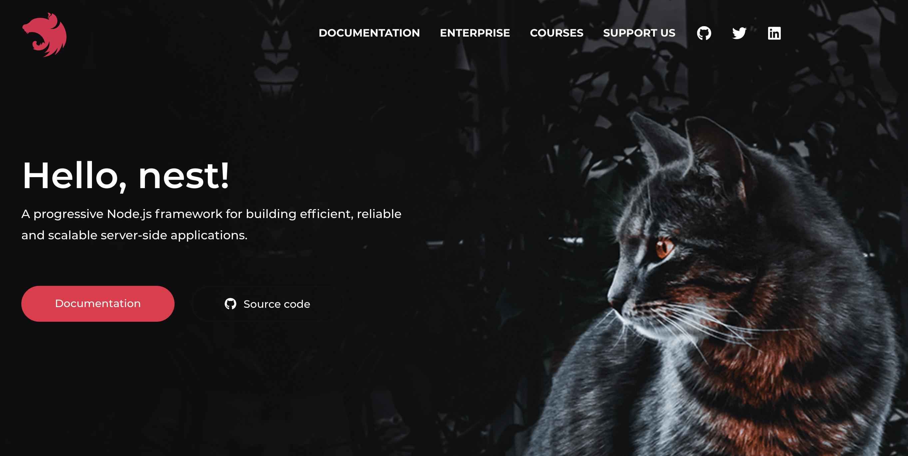

# 시작하며

NestJS 로 Backend service 를 개발하며 이 프레임워크로 어떻게 Microservice architecture, Domain-driven design, CQRS 를 구현하면 좋을것인가에 대해 정리해보고자 합니다.

## NestJS

Express.js 를 주로 이용해서 Backend 를 개발을 하다가 NestJS 라는 프레임워크로 개발을 하게 되었습니다. 처음 알게된건 훨씬 더 이전이었지만 실제로 본격적으로 사용한건 2019년 들어서부터 사용하게 되었습니다. Typescript 를 사용하는 서버 프레임워크이고 처음 접했을때는 Angular 와 유사한 구조를 가지고 있다는 생각을 많이 했는데 조금 알아보니 Angular 개발 인원이 NestJS 개발에 참여했다는 이야기가 있는걸로 보아 Angular 의 Component 구조 등의 영향을 받은것 같다는 생각이 듭니다. 그러나 JAVA, Kotlin 을 사용하는 Spring 또는 Spring boot 경험이 있는 개발자들의 이야기로는 Spring 프레임워크와 많이 닮아 있는 모습이라고 많이들 이야기 하는듯 하여 아마 Spring 에서도 많이 영향을 받지 않았을까 생각하고 있습니다.

> 고양이 사진이 매우 인상적입니다. 처음 봤을때는 다른 사이트에 잘못 접속한건가 했던 기억이 아직도 나네요.  
> 핑크색의 마크는 호랑이나 표범인줄알았는데 저것도 고양이인거 같습니다.

사용하면서 가장 잘 활용하고 있는것은 Typescript 로 OOP 를 활용할 수 있도록 해주는 점, CQRS 에 관한 package 를 지원하기 때문에 그것도 굉장히 잘 사용하고 있습니다. 공식 문서를 보면 지원하는 기능이 굉장히 많은것을 알 수 있으니 확인해보고 사용해보는것이 좋습니다. 버전도 거의 Angular 처럼 일년에 한번씩 올라가니 꼭 버전을 확인하고 사용하길 추천합니다.

작성한 코드를 보면 NestJS 에서 지원하지만 그렇게 사용하지 않은 부분도 많습니다. 그 이유는 NestJS 에서 제공하는 형태로는 원하는 구조를 만들수 없어서 좀 더 손을 쓰더라도 생각했던 구현체를 만들기위함이 제일 컸습니다. TypeORM 으로 자동으로 Repository 를 만들어서 Inject 해주거나, Passport JWT 를 Module 선언에 같이 작성하여 사용할 수 있도록 하는 등의 기능이 있었지만, 구현체 자체가 생략되면서 기능을 추가할 수 없다거나 원하는 방향으로 코드를 분리할수 없는 등 제한이 생겨서 이런 부분들은 사용하지 않는것이 더 좋겠다고 판단했습니다. 그 외의 부분들은 공식 문서와 예제를 기본으로 따르도록 했으며 앞으로 NestJS 가 업데이트 되어 가는것에 따라서 작성한 코드를 어떻게 더 보완해나갈지 고민할 예정입니다.

