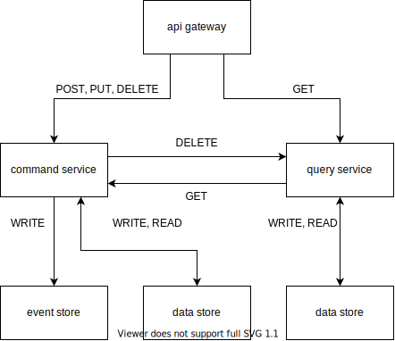

# 구조와 동작 원리

서비스의 개념적인 구조도는 위와 같습니다. CQRS 모델 중 간단한 모델은 하나의 서비스 안에서 Command 와 Query 를 분리 구현 하는것만으로도 충분하지만 Command, Query 서비스와 데이터베이스까지 분리하는 모델을 구현해보고자 위와 같이 인프라를 구성해보았습니다.

클라이언트가 시스템에 요청하는 시나리오를 토대로 인프라내의 서비스들의 동작을 설명하도록 하겠습니다. 이 시나리오에서 등장하는 클라이언트는 HTTP 를 사용하는 클라이언트로 이 클라이언트가 시스템에 요청을 보내면서 가장 먼저 마주하게 되는 것은 API Gateway 입니다. API Gateway 에서는 클라이언트의 요청을 Access token 을 이용하여 인증하고 요청된 경로를 이용하여 내부 서비스로 라우팅하는 역할을 합니다. API Gateway 에서는 이외의 서비스 로직등을 가지지 않습니다. 

이 시스템에서 내부 통신은 전부 HTTP 를 이용하도록 하였습니다. Command service 와 Query service 가 데이터 저장소까지 분리되어 있는 구조에서 메세지를 이용한 비동기 통신을 사용하여 데이터를 동기화 할 수 있지만, Command 에 의한 변경을 Query 에서 즉시 사용할 수 있도록 HTTP 를 이용한 API 호출로 구성하였습니다.

먼저 REST 형식에서 리소스 변경을 의미하는 POST, PUT, DELETE 요청에 대한 동작을 살펴보겠습니다. 이 세가지 메소드를 이용한 요청은 리소스의 변경을 의미하기 때문에 CQRS 에서 데이터의 변경을 담당하는 Command 를 사용하게 됩니다. 따라서 API Gateway 에서는 요청을 Command service 로 라우팅하고 요청을 받은 Command service 는 요청을 처리하고 응답을 하게 되는데 요청을 처리하는 과정은 아래와 같습니다.

1. 트랜잭션을 시작하며 도메인에 대한 변경을 진행
2. Query service 에 변경된 도메인과 매핑되는 리소스 삭제 요청
3. Event store 에 발생한 이벤트 저장
4. 저장소에 변경사항 저장 및 트랜잭션 종료

마지막으로 클라이언트가 HTTP GET 을 이용하여 데이터를 읽는 요청을 처리하는 과정을 살펴보도록 하겠습니다. 시스템에서 클라이언트의 요청은 동일하게 API Gateway 를 통하여 받고, 요청을 Query service 로 라우팅하게 됩니다. 요청을 라우팅 받은 Query service 는 아래와 같이 요청을 처리하게 됩니다.

1. 저장소에서 요청받은 데이터 조회
2. 데이터가 있을시 조회된 데이터 응답
3. 데이터가 없을시 Command service 로 데이터 요청
4. Command service 에 요청하여 받은 데이터를 저장소에 저장 후 데이터 응답

앞서 언급하였지만, Command service 와 Query service 의 데이터 동기화가 즉시 이루어지지 않아도 된다면 서비스간 통신을 Message 를 이용한 비동기 통신으로 구성할 수 있습니다. 이는 Command, Query 만의 관계뿐만 아니라 시스템 내부의 다른 서비스들로 이벤트 전파에 사용하여 서비스간 의존도를 낮출수 있습니다. 또한 HTTP 가 아닌 gRPC 등으로 통신속도 개선등을 고려해볼수 있습니다.

TODO: Event sourcing

